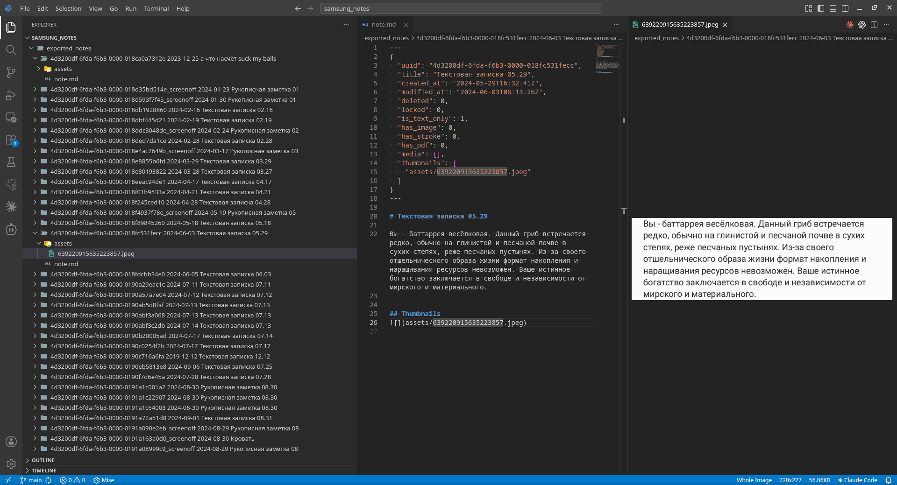

# Samsung Notes Markdown Exporter

Export Samsung Notes data from the Windows app cache to Markdown files with image assets.

Tested with Samsung Notes for Windows ver. 4.3.826.0



## What It Exports

- note text from `Storage.sqlite`
- inserted images from `wdoc/<note-uuid>/media`
- thumbnails from `Thumbnail`
- clean `note.md` files without metadata front matter
- `index.json` with metadata for all exported notes

Output layout:

```text
exported_notes/
  index.json
  <uuid> <date> <title>/
    note.md
    assets/
      image.jpg
      thumbnail.jpeg
```

## Requirements

- Python 3.10+
- no third-party packages

## Find Samsung Notes Data

On Windows, Samsung Notes usually stores local data here:

```text
%LOCALAPPDATA%\Packages\SAMSUNGELECTRONICSCoLtd.SamsungNotes_wyx1vj98g3asy\LocalState
```

Copy that `LocalState` directory somewhere safe before running export.

## Export

```bash
python3 scripts/export_notes.py /path/to/LocalState -o exported_notes
```

Include deleted notes:

```bash
python3 scripts/export_notes.py /path/to/LocalState -o exported_notes --include-deleted
```

Use folder names without UUIDs:

```bash
python3 scripts/export_notes.py /path/to/LocalState -o exported_notes --no-uuid-folders
```

Duplicate names get numeric suffixes like `2024-01-01 Note 2`.

## Inspect

Optional diagnostic command:

```bash
python3 scripts/inspect_notes.py /path/to/LocalState/Storage.sqlite
```

It prints note counts, deleted/locked flags, text availability, media flags, and modified date range. You do not need it for export.

## Notes

- `CreatedAt` can be import time, so export sorting uses `LastModifiedAt`.
- Handwriting `.spi`, `.note`, and `.page` files are not decoded.
- Notes with handwriting still get available searchable text and thumbnails.
- Keep `Storage.sqlite`, `wdoc`, `Thumbnail`, and exported private notes out of public Git repositories.
